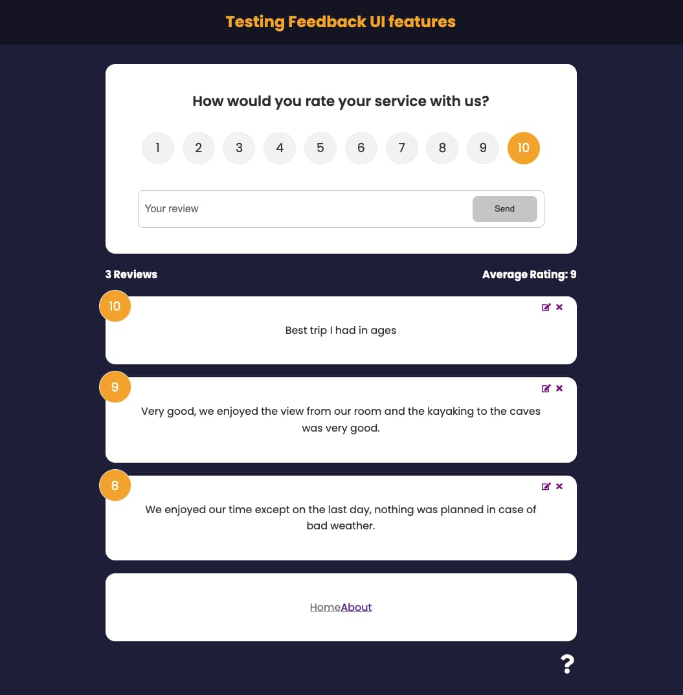

# Implementing interactive UI Features

## Features

I created this app so that I can practice with React!
A user rates a service and writes a review about it. 
The app displays all the reviews in cards.
It also displays the number of reviews and the average rating

## Make it work...

You can clone this repository and make it better ... it sure has Room For Improvement!

It is a React App so once you `npm install`  it from the project directory 
you can run `npm start`.

Runs the app at [http://localhost:3000](http://localhost:3000) on your browser.

## React Hooks used:   `useState, useContext, useEffect`

## Other:   `Routes, React-icons, framer-motion`

## Screenshot: 

